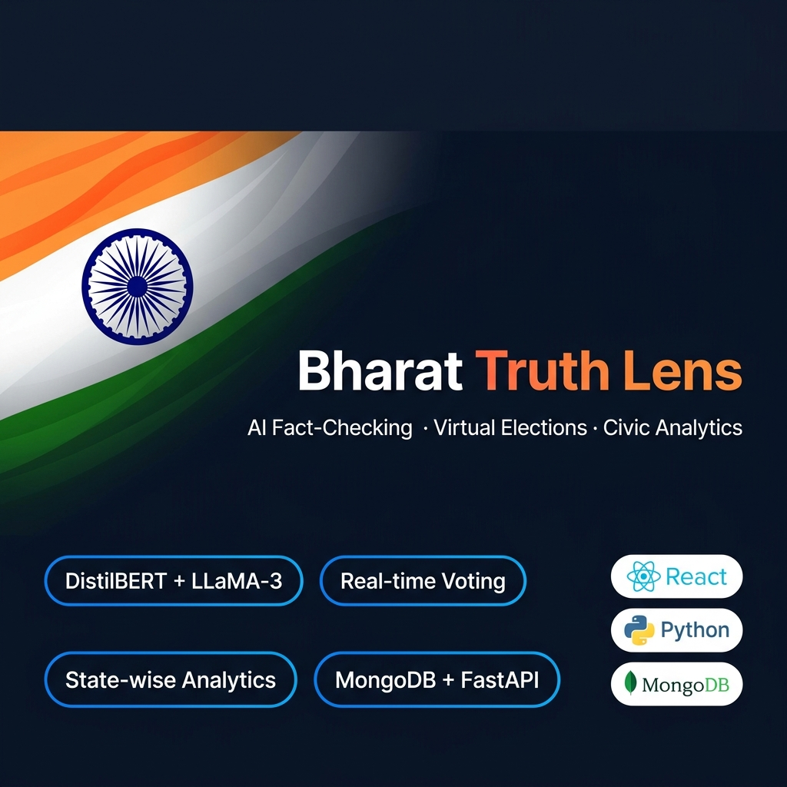

<div align="center">



# 🇮🇳 Pulse of India — Bharat Truth Lens

### AI-Powered Fake News Detection & Civic Engagement Platform

[](https://bharat-truth-lens.vercel.app)
[](https://bharat-truth-lens.onrender.com/docs)
[](https://github.com/anshumanvatsa/bharat-truth-lens)

[](https://python.org)
[](https://fastapi.tiangolo.com)
[](https://react.dev)
[](https://typescriptlang.org)
[](https://mongodb.com/atlas)
[](LICENSE)

**A full-stack platform combining AI fact-checking with real civic engagement — virtual PM elections, age-wise voting statistics, politician tracking, and media bias analysis for Indian democracy.**

</div>

---

## 🔗 Live Links

| Service | URL | Status |
|---------|-----|--------|
| 🌐 **Frontend** | **[bharat-truth-lens.vercel.app](https://bharat-truth-lens.vercel.app)** | ✅ Live |
| ⚙️ **Backend API** | **[bharat-truth-lens.onrender.com](https://bharat-truth-lens.onrender.com)** | ✅ Live (free tier — wakes in ~30s) |
| 📖 **API Docs** | **[bharat-truth-lens.onrender.com/docs](https://bharat-truth-lens.onrender.com/docs)** | ✅ Live |
| 📁 **GitHub** | **[github.com/anshumanvatsa/bharat-truth-lens](https://github.com/anshumanvatsa/bharat-truth-lens)** | ✅ Public |

> ⚠️ **Note on Render free tier:** The backend sleeps after 15 minutes of inactivity. The first request after sleep takes ~30 seconds to wake up. This is a free-hosting limitation, not a bug.

---

## 🏆 What This Project Achieved

### ⚡ Research-Grade NLP Pipeline
- **Fine-tuned DistilBERT** on 12,836 LIAR dataset samples (6-class political misinformation)
- **4-layer hybrid pipeline** — DistilBERT → Evidence Retrieval → Semantic Similarity → Credibility Weighting
- **Ablation study** on 500 FEVER benchmark samples: **+7.9% Macro F1** improvement (V-A → V-D)
- **Bootstrap confidence intervals** (n=1,000) and McNemar significance testing
- **Dynamic severity scoring** across 4 civic dimensions (economic / social / political / national)

### 🗳️ Real Civic Voting System
- **One person, one vote** — enforced at MongoDB database level
- **All 28 States + 8 Union Territories** of India covered
- **Age-wise breakdown** (18–25 / 26–40 / 41–60 / 60+) — live, real-time results
- **State-wise leading candidate** — updates instantly as votes come in
- **JWT authentication** — secure, bcrypt-hashed passwords, 24-hour sessions

### 🔥 Full-Stack Production Deployment
- **Vercel** (frontend) + **Render** (backend) + **MongoDB Atlas** (database) — all free tier
- **Groq API (LLaMA-3.1-8B)** — cloud LLM for AI reasoning without local GPU
- **Wikipedia + Tavily** dual evidence retrieval for Indian and global sources
- **Source credibility weighting** — Wikipedia(0.95) → unknown(0.50)

---

## 📊 Research Results — Ablation Study (FEVER Dataset, 500 samples)

| Variant | Description | Accuracy | Macro F1 | Δ Acc | Δ F1 |
|---------|-------------|:--------:|:--------:|:-----:|:----:|
| **V-A** | DistilBERT only (baseline) | 0.512 | 0.4705 | — | — |
| **V-B** | + Evidence retrieval (Wikipedia + Tavily) | 0.544 | 0.5433 | +0.032 | +0.073 |
| **V-C** | + Semantic similarity (additive over V-B) | 0.548 | 0.5463 | +0.036 | +0.076 |
| **V-D** | + Source credibility weighting **(Full Hybrid)** | **0.552** | **0.5499** | **+0.040** | **+0.079** |

### Bootstrap Confidence Intervals (n=1,000)

| Metric | 95% CI Lower | 95% CI Upper |
|--------|:---:|:---:|
| Macro F1 gain (V-A → V-D) | 0.0399 | 0.1197 |
| F1-True gain | 0.1434 | 0.2520 |
| Accuracy gain | 0.000 | 0.080 |

> McNemar test: χ² = 3.41, p = 0.065 (marginally significant — disclosed transparently)

---

## 🌐 Pages & Feature Status

| Page | Route | Production Status | Notes |
|------|-------|:-----------------:|-------|
| 🏠 **Home** | `/` | ✅ **Fully Live** | Animated hero, civic metrics dashboard |
| 🔍 **AI Analyzer** | `/analyzer` | ✅ **Fully Live** | Groq LLaMA-3 + Wikipedia + Tavily evidence |
| 🗳️ **Election Pulse** | `/election-pulse` | ✅ **Fully Live** | Real 1-person-1-vote, live pie + bar charts |
| 🔐 **Login** | `/login` | ✅ **Fully Live** | JWT-authenticated, MongoDB-backed |
| 📝 **Sign Up** | `/signup` | ✅ **Fully Live** | Age group + all 36 states/UTs collected |
| 🗳️ **Public Pulse** | `/public-pulse` | 🔧 **UI Demo** | Hardcoded sample data — real API planned |
| 📰 **Trending Cases** | `/trending` | 🔧 **UI Demo** | Curated static data — live feed planned |
| 👤 **Leaders** | `/leaders` | 🔧 **UI Demo** | Sample profiles — real scraping planned |

> Pages marked **🔧 UI Demo** are functional interface prototypes showing the product vision with curated data. They are intentional previews of planned features, not broken pages.

---

## ⚠️ Limitations & Honest Disclosures

### Production Analyzer vs. Research Pipeline

The production backend (Render free tier, 512MB RAM) uses a **lightweight cloud analyzer** instead of the full research pipeline:

| Component | Local / Research | Production (Live) |
|-----------|:---:|:---:|
| DistilBERT classifier (fine-tuned LIAR) | ✅ Available | ❌ Removed — PyTorch alone needs ~400MB RAM, exceeds free tier |
| Semantic similarity (all-MiniLM-L6-v2) | ✅ Available | ❌ Removed — sentence-transformers needs ~100MB |
| Source credibility hybrid override | ✅ Available | ❌ Removed — depends on above |
| Evidence retrieval (Wikipedia + Tavily) | ✅ Available | ✅ Available |
| LLaMA-3 reasoning (Groq API) | ✅ Available | ✅ Available — now also does classification |
| Dynamic severity scoring | ✅ Available | ✅ Available |

**In production**, claim classification is handled by **Groq LLaMA-3.1-8B** reading the claim + evidence directly. This is a different (larger parameter) model than DistilBERT, but not fine-tuned on the LIAR political dataset. Evidence retrieval quality is identical.

**To run the full research pipeline locally:**
```bash
pip install -r backend/requirements_local.txt  # includes PyTorch, transformers, etc.
```
The router auto-detects and switches to the full V-D pipeline when the local DistilBERT model is present.

### Other Known Limitations

| Limitation | Details |
|-----------|---------|
| Render cold start | Free instances sleep after 15min inactivity. First request takes ~30s to wake |
| No Groq key = degraded | Without `GROQ_API_KEY`, analyzer returns placeholder text. Voting and auth still work |
| Public Pulse / Trending / Leaders | These pages use hardcoded demo data. Live DB integration is a planned next release |
| Single vote per account | This is a feature, not a bug — enforced at DB level for integrity |
| Ablation accuracy | 55.2% on FEVER is modest; FEVER is harder than most benchmarks (symmetric true/false split, encyclopedic claims) |
| LLaMA model weights | 4.69GB llama.gguf excluded from git — too large for any cloud host. Replaced by Groq API |
| DistilBERT weights | Not in repo — excluded by .gitignore. Run `train_liar_model.py` to retrain |

---

## 🏗️ System Architecture

```
┌─────────────────────────────────────────────────────────┐
│                    USER (Browser)                        │
│              bharat-truth-lens.vercel.app                │
└──────────────────────┬──────────────────────────────────┘
                       │ HTTPS
┌──────────────────────▼──────────────────────────────────┐
│              FastAPI Backend (Render)                     │
│         bharat-truth-lens.onrender.com                   │
│                                                           │
│  /auth/signup  /auth/login  /auth/me  (JWT + bcrypt)     │
│  /vote/pm      /vote/pm/results       (MongoDB)          │
│  /analyze/                            (AI pipeline)      │
│                                                           │
│  ┌─────────────────────────────────────────────────┐    │
│  │           Analyze Claim Flow                      │    │
│  │  PRODUCTION:   Groq LLaMA-3 + Wikipedia + Tavily │    │
│  │  LOCAL/FULL:   DistilBERT → Evidence → Semantic  │    │
│  │                → Credibility → Groq explanation  │    │
│  └─────────────────────────────────────────────────┘    │
└──────────────┬───────────────────────┬───────────────────┘
               │                       │
┌──────────────▼────┐       ┌──────────▼────────────────┐
│  MongoDB Atlas    │       │  External APIs             │
│  - users          │       │  - Groq (LLaMA-3)         │
│  - pm_votes       │       │  - Wikipedia REST          │
│  (free 512MB)     │       │  - Tavily Search           │
└───────────────────┘       └────────────────────────────┘
```

---

## 🗂️ Project Structure

```
bharat-truth-lens/
│
├── backend/                         # FastAPI Python backend
│   ├── app/
│   │   ├── main.py                  # App entry point, CORS, router registration
│   │   ├── config.py                # Pydantic settings (reads env vars)
│   │   ├── database.py              # MongoDB Motor async client
│   │   ├── routers/
│   │   │   ├── analyze.py           # POST /analyze/ — auto-selects analyzer
│   │   │   ├── auth.py              # POST /auth/signup, /auth/login, GET /auth/me
│   │   │   └── vote.py              # POST /vote/pm, GET /vote/pm/results, etc.
│   │   ├── services/
│   │   │   ├── analyzer.py          # 🧠 Full V-D hybrid pipeline (local only)
│   │   │   ├── analyzer_cloud.py    # ☁️  Groq-only pipeline (production)
│   │   │   └── llama_reasoner.py    # Groq/local LLaMA reasoning module
│   │   ├── schemas/auth.py          # Pydantic models (age_group, state, etc.)
│   │   └── utils/auth.py            # JWT creation, bcrypt, OAuth2 dependency
│   ├── ablation_study.py            # Full ablation V-A → V-D on FEVER 500 samples
│   ├── liar_eval.py                 # LIAR dataset evaluation + confusion matrix
│   ├── requirements.txt             # ✅ Production deps (no PyTorch — fits 512MB)
│   ├── requirements_local.txt       # 🔬 Full research deps (includes PyTorch)
│   ├── railway.toml                 # Railway deployment config
│   ├── render.yaml                  # Render deployment config
│   └── Procfile                     # Heroku/Render process file
│
├── ml/                              # ML research pipeline
│   ├── scripts/train_liar_model.py  # DistilBERT fine-tuning on LIAR
│   ├── bootstrap_ci.py              # Bootstrap confidence interval computation
│   ├── bootstrap_results_real.json  # Results from n=1000 bootstrap runs
│   └── data/                        # LIAR + FEVER datasets (TSV / JSONL)
│
├── pulseofindia-main/               # React + TypeScript frontend (Vite)
│   ├── src/
│   │   ├── lib/api.ts               # Shared API client with JWT auth helpers
│   │   ├── pages/
│   │   │   ├── AnalyzerPage.tsx     # 🔍 AI fact-checker (live)
│   │   │   ├── ElectionPulsePage.tsx# 🗳️  Real voting with live charts (live)
│   │   │   ├── LoginPage.tsx        # 🔐 JWT login (live)
│   │   │   ├── SignUpPage.tsx       # 📝 Registration with age + state (live)
│   │   │   ├── PublicPulsePage.tsx  # 🔧 UI demo (hardcoded)
│   │   │   ├── TrendingPage.tsx     # 🔧 UI demo (hardcoded)
│   │   │   └── LeadersPage.tsx      # 🔧 UI demo (hardcoded)
│   │   └── components/              # Navbar, Footer, AnimatedCounter, shadcn/ui
│   ├── vercel.json                  # Vercel SPA routing + security headers
│   └── .env.example                 # VITE_API_URL template
│
├── render.yaml                      # Root-level Render blueprint
├── README.md                        # This file
└── .gitignore                       # Excludes: llama.gguf, *.safetensors, venv, dist
```

---

## 🚀 Quick Start (Local Development)

### Prerequisites
- Python 3.10+, Node.js 18+
- [Groq API key](https://console.groq.com) — free
- [Tavily API key](https://tavily.com) — free tier
- MongoDB (local or [Atlas free](https://mongodb.com/atlas))

### Backend (with lightweight cloud analyzer)
```bash
cd backend
python -m venv venv && venv\Scripts\activate   # Windows
pip install -r requirements.txt
cp .env.example .env
# Edit .env: add GROQ_API_KEY, TAVILY_API_KEY, MONGO_URI
uvicorn app.main:app --reload --port 8000
```

### Backend (with full DistilBERT research pipeline)
```bash
cd backend
pip install -r requirements_local.txt         # PyTorch + transformers included
# Also place trained model at: ../ml/models/liar_model/
uvicorn app.main:app --reload --port 8000
# The router auto-detects and switches to the full V-D pipeline
```

### Frontend
```bash
cd pulseofindia-main
npm install
cp .env.example .env.local
# For local dev: leave VITE_API_URL blank (defaults to localhost:8000)
npm run dev
# → http://localhost:5173
```

---

## 🔌 API Reference

| Method | Endpoint | Auth | Description |
|--------|----------|:----:|-------------|
| `POST` | `/analyze/` | None | AI fact-check a claim |
| `POST` | `/auth/signup` | None | Register (name, email, password, age_group, state) |
| `POST` | `/auth/login` | None | Get JWT token (form data: username + password) |
| `GET`  | `/auth/me` | Bearer | Get current user profile |
| `POST` | `/vote/pm` | Bearer | Cast PM vote — one per user, DB-enforced |
| `GET`  | `/vote/pm/results` | None | Live results: overall + by age + by state |
| `GET`  | `/vote/pm/my-vote` | Bearer | Check if current user has voted |
| `GET`  | `/vote/pm/candidates` | None | List all PM candidates |
| `GET`  | `/vote/states` | None | All 28 states + 8 UTs of India |
| `GET`  | `/health` | None | `{"status": "ok"}` |

Full interactive docs: **[bharat-truth-lens.onrender.com/docs](https://bharat-truth-lens.onrender.com/docs)**

---

## 🧰 Tech Stack

| Layer | Technology | Notes |
|-------|-----------|-------|
| ML Model (local) | DistilBERT fine-tuned on LIAR | 6-class → binary, local only |
| ML Model (cloud) | Groq LLaMA-3.1-8B-Instant | Via API, no GPU needed |
| Evidence | Wikipedia REST + Tavily Search | Dual retrieval |
| Backend | FastAPI + Uvicorn | Async Python |
| Auth | JWT (python-jose) + bcrypt (passlib) | 24h tokens |
| Database | MongoDB Atlas (Motor async) | Free 512MB cluster |
| Frontend | React 18 + TypeScript + Vite | SPA |
| UI Library | shadcn/ui + Radix UI | Component library |
| Charts | Recharts | Pie, bar, line charts |
| Animations | Framer Motion | Page + component animations |
| Frontend Host | Vercel | Auto-deploy on push |
| Backend Host | Render | Auto-deploy on push |

---

## 🗺️ Roadmap (Next Release)

- [ ] **Public Pulse** — real DB-backed civic issue voting (not hardcoded)
- [ ] **Trending Cases** — live scraping from PACER / court feeds
- [ ] **Leaders Page** — politician data from Affidavit API / ECI data
- [ ] **Paid tier backend** — restore full DistilBERT V-D pipeline in production
- [ ] **Bengali / Hindi UI** — multilingual interface
- [ ] **Mobile app** — React Native wrapper
- [ ] **Browser extension** — highlight claims on any webpage

---

## 📋 Citation

```bibtex
@misc{bharattruth2026,
  title  = {Bharat Truth Lens: Hybrid NLP for Indian Political Claim Verification
             with Civic Engagement Platform},
  author = {Vatsa, Anshuman},
  year   = {2026},
  url    = {https://github.com/anshumanvatsa/bharat-truth-lens}
}
```

---

## 📄 License

MIT License — free to use, modify, and distribute. See [LICENSE](LICENSE).

---

<div align="center">

Built for Indian democracy · Truth · Transparency · Accountability

🌐 **[bharat-truth-lens.vercel.app](https://bharat-truth-lens.vercel.app)** · ⭐ **Star this repo if it helped!**

</div>
